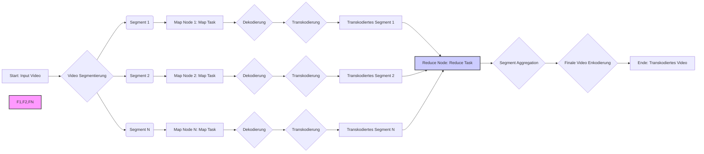

# flotte

**Erläuterung der Zeichnung:**

* **Start: Input Video (A):**  Der Prozess beginnt mit dem Eingabevideo, das transkodiert werden soll.
* **Video Segmentierung (B):** Das Eingabevideo wird in mehrere Segmente aufgeteilt. Dies ermöglicht die parallele Verarbeitung durch die Map-Nodes.
* **Segment 1, Segment 2, Segment N (C, D, E):** Repräsentieren die einzelnen Video-Segmente, die erzeugt wurden.
* **Map Node 1, Map Node 2, Map Node N: Map Task (F1, F2, FN):**  Stellen die verschiedenen Knoten im MapReduce-Cluster dar, die die Map-Aufgaben ausführen. Jeder Knoten erhält ein oder mehrere Video-Segmente zur Verarbeitung.
* **Dekodierung (G1, G2, GN):**  Innerhalb jedes Map-Nodes wird das zugewiesene Video-Segment zunächst dekodiert.
* **Transkodierung (H1, H2, HN):**  Nach der Dekodierung erfolgt die eigentliche Transkodierung des Segments in das gewünschte Zielformat.
* **Transkodiertes Segment 1, Transkodiertes Segment 2, Transkodiertes Segment N (I1, I2, IN):**  Die Ergebnisse der Map-Phase. Jeder Map-Node gibt ein transkodiertes Video-Segment aus.
* **Reduce Node: Reduce Task (J):**  Ein zentraler Knoten, der die Reduce-Aufgabe übernimmt. Er sammelt die transkodierten Segmente von den Map-Nodes.
* **Segment Aggregation (K):**  Der Reduce-Node führt die transkodierten Segmente in der korrekten Reihenfolge zusammen.
* **Finale Video Enkodierung (L):**  Nach der Aggregation kann eine finale Enkodierung des gesamten Videos erfolgen, falls notwendig.
* **Ende: Transkodiertes Video (M):**  Der Prozess endet mit der Ausgabe des vollständig transkodierten Videos.

**Mermaid Code:**

